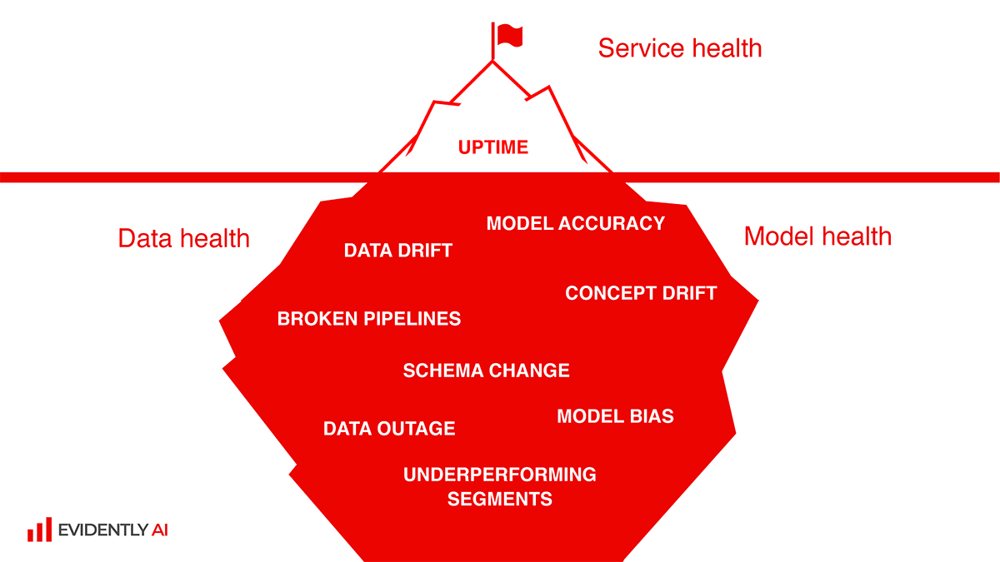
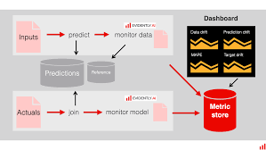

# MLOps Zoomcamp Ch5: Monitoring ML models in Production
This module is focussed on how to monitor ML model performance once they are in production. There are lots of different aspects to monitoring, it is far more than just designing a model and implementing it. This also means there are lots of things that can go wrong.

The picture below seems to sum it up in three main areas
* **Service Health**: The visible tip of the iceberg, i.e. when the service/model is actually producing a result/prediction. This could include things such as processing time, response latency, etc.
* **Data Health**: Is the data that the model is using for predictions significantly different to the data that the model was trained on? Has something changed in the data structure and/or file formats etc. All of these things need to be accounted for.
* **Model Health**: Is the production model's framework still the best option of there. Has the model unwittingly added in a bias towards particular groups etc. 

These three areas tend to overlap with particular issues such as data drift affecting more than one araea of monitoring.

## 5.1: Intro to ML Monitoring
### Service Health monitoring
Service health monitoring is key to measuring the time when the model is actually working.
Example metrics include...
* `Uptime`
* `Memory Usage`
* `Latency`:

### Model performance
Metric qualities, e.g. F1 score, Log-loss, RMSE. This depends on the type of model. Typically this would be based on batch data that comes later as we will not have ground truth data coming in.

### Data quality and integrity
Check the quality of the data.
e.g. Number of NaNs, Number of columns, etc.

### Data and concept drift
Real world data is always changing, perhaps distributions change, etc. Monitoring any changes 

### Some others to consider
* `Performance by segment`: E.g. split out your metrics by class/category so you have higher granularity.
* `Model bias/fairness`: What are the actual weights and biases, and would they be ethical. If when you update the model it produces new weights are you sure that they may not be discriminatory, or if regulation is introduced perhaps one of your features may no longer be available.
* `Outliers`: If the cost of an individual error is high, outliers may need to be considered separately.
* `Explainability`: E.g. Looking at SHAP results etc.

### Batch vs Online Serving Models

#### Architecture
If it is mature you may need to add extra ML metrics to monitor performance. In other words your team has already set some stuff up and you just need to augment existing plans/software (e.g. [Prometheus](https://prometheus.io/) or [Grafana](https://grafana.com/)).

If you are starting from scratch you may have to build the data yourself from the original data sources (e.g. MongoDB/Grafana, or BI tools such as Tableu and Looker).

#### Batch
Batch is based on training data or past batch. For example you can measure things such as 
* expected data quality
* data distribution tyoe
* descriptive statistics
    * point estimations
    * Stat tests to measure CI

#### Non-batch
This would be frameworks such as streaming, where you have a continuous data stream. One option is to window, i.e. sample from a moving time window and compare changes between time windows. In other words you kind of *"batchify" (if that is even a word)* it

### Example Monitoring Scheme
Use the taxi data and prefect to to the monitoring, and grafana for the dashboard. (Or do the entire thing in Mage)

## Resources
* [Why you need ML Monitoring](https://www.evidentlyai.com/blog/ml-monitoring-metrics)
* [Machine Learning Monitoring, Part 5: Why You Should Care About Data and Concept Drift](https://www.evidentlyai.com/blog/machine-learning-monitoring-data-and-concept-drift)