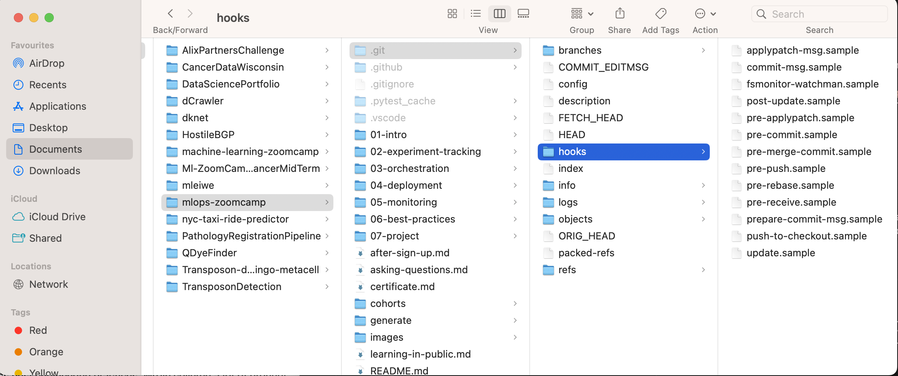

# Chapter 6: Best Practices

## Introduction
This is going to build on top of what we did in chapter 4
We had one [Lambda Function](../../../04-deployment/streaming/lambda_function.py), one input Kinesis stream serving the function with ride events, and an output stream which read the outputs of the lambda function, finally we read the model in from an S3 bucket that stores our MLflow artefacts.


We have also copied all the relevant code into the [./mlops-zoomcamp/06-best-practices/code](../../../06-best-practices/code/) folder.


## 6.1 Unit Testing Python code with pytest
The aim here is to create unit tests with pytest to ensure that the model is working properly and effectively. But first a few definitions to help us be a bit clearer

**Unit tests**: When we test individual "units" of our code. These are often individual blocks, or functions that make up our pipeline.
**Integration tests**: This is when we test the whole code to make sure it does what it it supposed to.

### Set up initial Venv
First we can set up our venv, so navigate to `./mlops-zoomcamp/06-best-practices/code` and create your venv with pipenv
```bash
pipenv install
```
Then we should also create a folder to store our tests
```bash
mkdir tests
```
Now for a new part, to run the tests we need to install a new library, [pytest](https://docs.pytest.org/en/8.2.x/). However we only need this in dev, and loading in an extra dependancy into a lambda function will cause it to cost more money. Therefore, we can configure it to only be installed in the dev envrionment with the command
```bash
pipenv install --dev pytest
```
Once this has finished installing your pipfile should look something similar to this

```pipfile
[[source]]
url = "https://pypi.org/simple"
verify_ssl = true
name = "pypi"

[packages]
boto3 = "*"
mlflow = "*"
scikit-learn = "==1.0.2"

[dev-packages]
pytest = "*"

[requires]
python_version = "3.9"
```
### Configure VSCode to run pytest
### Install Python in VSCode
First if you are going to use VSCode, make sure you have the python extension installed. You can check this out by clicking on the extension icon on the left hand side (red circle). Then searching for "Python". If it is installed there should be the option "disable" on the main pane. If not click "enable"/"install" to allow you to use python inside VSCode.


### Now select the correct interpreter

#### Check the pytest being used
First we need to check which pytest we have
```bash
which pytest
```
Which will probably return
```
/opt/anaconda3/bin/pytest
```
In this case pytest is coming from anaconda and not our shell environment so we need to change our environment. I.e. I've entered the main environment not the dev environment. To fix this, exit the venv and re-enter with the `--dev` tag.
```bash
exit
pipenv install --dev
pipenv shell
which pytest
```
In my case it returns the answer below which indicates it is now coming from my venv
```bash
./Users/marcusleiwe/.local/share/virtualenvs/code-WFCVXBst/bin/pytest
```

#### Select the Python Interpreter
Now with cmd + shift + p open the Command Pallette and select the python interpreter for our venv. This can be seen from the last command we typed in the terminal (red circle). In my case the venv's name is `code-WFCVXBst`. If you can find the name easily you can use `pipenv --venv` which will tell you the path to the venv and so reveal its name.


Once the interpreter is selected a testing icon should appear which is what we will use to configure tests. But first we need to decide what we are going to test.
 

So now in vscode, we can create two `.py` files in our `tests` folder
* `__init__.py`: This lets python know that tests is a python package. If you are unfamiliar with what an `__init__` file does, check out [this article](https://www.geeksforgeeks.org/what-is-__init__-py-file-in-python/).
* `model_test.py`: This will be the actual code that will run tests on the models. So we can import our python files in and create function tests. For example

```python
import lambda_function

def test_prepare_features():
    ride = {
        "PULocationID": 130,
        "DOLocationID": 205,
        "trip_distance": 3.66
    }
    actual_features = lambda_function.prepare_features()
    expected_features = {
        "PU_DO": "130_205",
        "trip_distance": 3.66
    }

    assert actual_features == expected_features
```
### Fixing the Lambda function
If we directly use the lambda_function as in this case here, the test will fail because we have to set up all the AWS infrastructure to match it. And the lambda function is very big so it is hard to tell where is it going wrong. To that end we created a model.py file that we will test that mimics the lambda handler.The final version is here:[model.py](../../../06-best-practices/code/model.py) but I will go step by step through the logic of what we did.

#### Create a model service class
The easiest thing to do here is create a model class that will help us call all the functions and set the attributes foe each model. There's a [helpful discussion on stack overflow](https://stackoverflow.com/questions/33072570/when-should-i-be-using-classes-in-python) that outlines the reasons. But essentially we can set the attributes for each model with a function, and then rather than being global variables/attributes, they can be stroed separately for each function.

```python
#Set up the model class
class ModelService():
    def __init__(self, model):
        self.model = model
    
    #Functions
    def prepare_features(self,ride):
        features = {}
        features['PU_DO'] = f"{ride['PULocationID']}_{ride['DOLocationID']}"
        features['trip_distance'] = ride['trip_distance']
        return features

    def predict(self, features):
        pred = self.model.predict(features)
        return float(pred[0])

    def lambda_handler(self, event):
        predictions_events = []

        for record in event['Records']:
            encoded_data = record['kinesis']['data']
            ride_event = base64_decode(encoded_data)

            # print(ride_event)
            ride = ride_event['ride']
            ride_id = ride_event['ride_id']

            features = self.prepare_features(ride)
            prediction = self.predict(features)

            prediction_event = {
                'model': 'ride_duration_prediction_model',
                'version': self.model_version,
                'prediction': {'ride_duration': prediction, 'ride_id': ride_id},
            }

            for callback in self.callbacks:
                callback(prediction_event)

            predictions_events.append(prediction_event)

        return {'predictions': predictions_events}
```
From here we just need the following two snippets to be added to the `model.py` file so that the model can be loaded, and then added to the instantiated version of our model class.
##### Load in the model
```python
#Find where in the S3 bucket the model is
def get_model_location(run_id):
    model_location = os.getenv('MODEL_LOCATION')

    if model_location is not None:
        return model_location

    model_bucket = os.getenv('MODEL_BUCKET', 'mlflow-models-alexey')
    experiment_id = os.getenv('MLFLOW_EXPERIMENT_ID', '1')

    model_location = f's3://{model_bucket}/{experiment_id}/{run_id}/artifacts/model'
    return model_location

#Load in the model
def load_model(run_id):
    model_path = get_model_location(run_id)
    model = mlflow.pyfunc.load_model(model_path)
    return model
```

##### Instatiate the model as a class.
```python
def init(prediction_stream_name: str, run_id: str, test_run: bool):
    model = load_model(run_id) #Load the model
    model_service = ModelService(model) #Instantiate it
    return model_service
```

#### Update the lambda function
Now that we have a `model.py` that does most of the heavy lifting we can dramatically simplify our lambda function. The code block below shows the details, but essentially now the key attributes for the model service are defined, and the rest of the code is hudden "under the hood" in the `model.py` file. 

```python
import os
import model

PREDICTIONS_STREAM_NAME = os.getenv('PREDICTIONS_STREAM_NAME', 'ride_predictions')
RUN_ID = os.getenv('RUN_ID')
TEST_RUN = os.getenv('TEST_RUN', 'False') == 'True'

model_service = model.init(
    prediction_stream_name=PREDICTIONS_STREAM_NAME,
    run_id=RUN_ID,
    test_run=TEST_RUN,
)

def lambda_handler(event, context):
    # pylint: disable=unused-argument
    return model_service.lambda_handler(event)
```


### Running the new model in docker
Now we want to test to see if the model is working properly by using the docker that we constructed previously. NB remember to copy over `model.py` as well as `lambda_function.py` when you build the docker again

```bash
FROM public.ecr.aws/lambda/python:3.9

RUN pip install -U pip
RUN pip install pipenv

COPY [ "Pipfile", "Pipfile.lock", "./" ]

RUN pipenv install --system --deploy

COPY [ "lambda_function.py", "model.py", "./" ]

CMD [ "lambda_function.lambda_handler" ]
```
Now you can build it

```bash
docker build -t stream-model-duration:v2 .
```

And run it

```bash
docker run -it --rm \
    -p 8080:8080 \
    -e PREDICTIONS_STREAM_NAME="ride_predictions" \
    -e RUN_ID="The_run_id_you_want"
    -e AWS_DEFAULT_REGION="eu-west-1" \
    stream-model-duration:v2
```

You can then run the [test_docker.py](../../../04-deployment/streaming/test_docker.py) script that will mock the input locally on a different terminal (i.e your local computer not the docker). And the results should appear afterwards.

```bash
python test_docker.py
```
### Updating the model_test.py
So currently our model function stands as this... 

```python
import lambda_function

def test_prepare_features():
    ride = {
        "PULocationID": 130,
        "DOLocationID": 205,
        "trip_distance": 3.66
    }
    actual_features = lambda_function.prepare_features()
    expected_features = {
        "PU_DO": "130_205",
        "trip_distance": 3.66
    }

    assert actual_features == expected_features
```
We need to make a few changes. Firstly we are no longer calling the `lambda_function.py` file. Now we should call the `model.py` and use that instead of the lambda_function, changes are on lines 1 and 11 in the code snippet below.

```python
import model

def test_prepare_features():
    model_service = model.ModelService(None)

    ride = {
        "PULocationID": 130,
        "DOLocationID": 205,
        "trip_distance": 3.66
    }
    actual_features = model_service.prepare_features()
    expected_features = {
        "PU_DO": "130_205",
        "trip_distance": 3.66
    }

    assert actual_features == expected_features
```
### Adding extra tests
As well as checking the actual encoding of features, we should also check to see if any other aspects have gone wrong. 

#### Add a decoding test
For example, the decoding step in the `model.py` file. This means we have to split this out as a separate function to test in the `model.py` file.

```python
def base64_decode(encoded_data):
    decoded_data = base64.b64decode(encoded_data).decode('utf-8')
    ride_event = json.loads(decoded_data)
    return ride_event
```
Now in the `model_test.py` file we can create another test function to try.
```python
def test_base64_decode():
    base64_input = "ewogICAgICAgICJyaWRlIjogewogICAgICAgICAgICAiUFVMb2NhdGlvbklEIjogMTMwLAogICAgICAgICAgICAiRE9Mb2NhdGlvbklEIjogMjA1LAogICAgICAgICAgICAidHJpcF9kaXN0YW5jZSI6IDMuNjYKICAgICAgICB9LCAKICAgICAgICAicmlkZV9pZCI6IDI1NgogICAgfQ=="

    actual_result = model.base64_decode(base64_input)
    expected_result = {
        "ride": {
            "PULocationID": 130,
            "DOLocationID": 205,
            "trip_distance": 3.66,
        },
        "ride_id": 256,
    }

    assert actual_result == expected_result
```
#### Add a predict test
"predict" is already a contained function in the lambda_handler of the `model.py` file so all we need to do is add another test function into our `model_test.py` file. 

However, a vital step in this process is to ensure that each test is independent of each other, so our prediction test should be different to our load_model test and so on. Therefore we will create a mock Model class that just returns a specified value when the function predict is called

```python
class ModelMock:
    def __init__(self, value):
        self.value = value

    def predict(self, X):
        n = len(X)
        return [self.value] * n

def test_predict():
    model_mock = ModelMock(10.0) #It will just return 10 when predict is run
    model_service = model.ModelService(model_mock)

    features = {
        "PU_DO": "130_205",
        "trip_distance": 3.66,
    }

    actual_prediction = model_service.predict(features)
    expected_prediction = 10.0

    assert actual_prediction == expected_prediction
```
#### Test the whole Lambda Handler
```python
def test_lambda_handler():
    model_mock = ModelMock(10.0)
    model_version = 'Test123'
    model_service = model.ModelService(model_mock, model_version)

    event = {
        "Records": [
            {
                "kinesis": {
                    "data": "ewogICAgICAgICJyaWRlIjogewogICAgICAgICAgICAiUFVMb2NhdGlvbklEIjogMTMwLAogICAgICAgICAgICAiRE9Mb2NhdGlvbklEIjogMjA1LAogICAgICAgICAgICAidHJpcF9kaXN0YW5jZSI6IDMuNjYKICAgICAgICB9LCAKICAgICAgICAicmlkZV9pZCI6IDI1NgogICAgfQ==",
                },
            }
        ]
    }

    actual_predictions = model_service.lambda_handler(event)
    expected_predictions = {
        'predictions': [
            {
                'model': 'ride_duration_prediction_model',
                'version': model_version,
                'prediction': {
                    'ride_duration': 10.0,
                    'ride_id': 256,
                },
            }
        ]
    }

    assert actual_predictions == expected_predictions
```
##### Callbacks
If you recall in the original function we had the predictions going to an output stream (see code snippet below) that we aren't going to test, and if we run it we need a Kinesis stream online.
```python
if not TEST_RUN:
    kinesis_client.put_record(
        StreamName=PREDICTION_STREAM_NAME,
        Data=json.dumps(prediction_event),
        PartitionKey=str(ride_id),
    )
```
Deleting/commenting it out is sub-optimal as it will be needed in the final model. So we need to rely on [callbacks](https://www.askpython.com/python/built-in-methods/callback-functions-in-python). Callbacks are essentially when one function is passed into another function as an argument, or called within a function.

In this case we want to make a function for outputing to a kinesis stream. So in the `init` of the `ModelService` class we add the argument `callbacks` which when specified will run the feature

```python
class ModelService:
    def __init__(self, model, model_version=None, callbacks=None):
        self.model = model
        self.model_version = model_version
        self.callbacks = callbacks or []
    
    # rest of the code...
            
            prediction_event = {
                'model': 'ride_duration_prediction_model',
                'version': self.model_version,
                'prediction': {'ride_duration': prediction, 'ride_id': ride_id},
            }
            #Now add in the callback(s) after the prediction_event has been created.
            for callback in self.callbacks:
                callback(prediction_event)

```

We also need to make changes to the `init` function in the `model.py` file. As well as creating a client class and a client callback function.
```python
#Create a new Kinesis class
class KinesisCallback:
    def __init__(self, kinesis_client, prediction_stream_name):
        self.kinesis_client = kinesis_client
        self.prediction_stream_name = prediction_stream_name

    def put_record(self, prediction_event):
        ride_id = prediction_event['prediction']['ride_id']

        self.kinesis_client.put_record(
            StreamName=self.prediction_stream_name,
            Data=json.dumps(prediction_event),
            PartitionKey=str(ride_id),
        )

#Create a kinesis client with boto3
def create_kinesis_client():
    endpoint_url = os.getenv('KINESIS_ENDPOINT_URL')

    if endpoint_url is None:
        return boto3.client('kinesis')

    return boto3.client('kinesis', endpoint_url=endpoint_url)

def init(prediction_stream_name: str, run_id: str, test_run: bool):
    model = load_model(run_id)
    #New code establishing the callback
    callbacks = []

    if not test_run:
        kinesis_client = create_kinesis_client()
        kinesis_callback = KinesisCallback(kinesis_client, prediction_stream_name)
        callbacks.append(kinesis_callback.put_record)
    #End of new code
    model_service = ModelService(model=model, model_version=run_id, callbacks=callbacks)

    return model_service
```

### Executing tests 
#### Run tests in VSCode UI
VSCode allows you to evaluate all the unit tests in the testing environment, if you click on the conical flask icon and then just click the run icon at the level that you want to run these tests.


The second option is to run each unit test individually by selecting the run icon immediately to the left of your test.py file. Personally I think this option is pretty useful when initially creating your tests.


#### Pytest in the CLI
Alongisde the UI based version in VSCode where you can simply click run once you click on the conical flask icon, you can also operate the unit tests in the CLI.

```bash
pipenv run pytest tests/
```

You can also run this from the base env if you have pytest installed there too, but what essentially happens is that pytest will run through your folder tests and execute all the .py files in there. In out case there is onlt the `model_test.py` which it will evaluate.

## 6.2 Intergration tests with docker compose
Unit tests only test individual components not the full pipeline. We've already created a [test_docker.py](../../../06-best-practices/code/test_docker.py) previously to evaluate the lambda function. What we need to do is simply add an assert at the end to test the final outcome.

```python
import requests 

event = {
    "Records": [
        {
            "kinesis": {
                "kinesisSchemaVersion": "1.0",
                "partitionKey": "1",
                "sequenceNumber": "49630081666084879290581185630324770398608704880802529282",
                "data": "ewogICAgICAgICJyaWRlIjogewogICAgICAgICAgICAiUFVMb2NhdGlvbklEIjogMTMwLAogICAgICAgICAgICAiRE9Mb2NhdGlvbklEIjogMjA1LAogICAgICAgICAgICAidHJpcF9kaXN0YW5jZSI6IDMuNjYKICAgICAgICB9LCAKICAgICAgICAicmlkZV9pZCI6IDI1NgogICAgfQ==",
                "approximateArrivalTimestamp": 1654161514.132
            },
            "eventSource": "aws:kinesis",
            "eventVersion": "1.0",
            "eventID": "shardId-000000000000:49630081666084879290581185630324770398608704880802529282",
            "eventName": "aws:kinesis:record",
            "invokeIdentityArn": "arn:aws:iam::387546586013:role/lambda-kinesis-role",
            "awsRegion": "eu-west-1",
            "eventSourceARN": "arn:aws:kinesis:eu-west-1:387546586013:stream/ride_events"
        }
    ]
}


url = 'http://localhost:8080/2015-03-31/functions/function/invocations'
actual_response = requests.post(url, json=event)
expected_response = {
    'predictions': [{
        'model': 'ride_duration_prediction_model',
        'version': 'e1efc53e9bd149078b0c12aeaa6365df',
        'prediction': {
            'ride_duration': 21.294545348333408,
            'ride_id': 256
        }
    }]
}
print('actual_response:')
print(json.dumps(actual_response, indent=2)

assert actual_response == expected_response
```

However, an issue with the code "as is" is that it doesn't tell you what is different between the two responses. While for this json the differences are manageable, for larger outputs it may take some time. Therefor it is recommended to use [DeepDiff](https://pypi.org/project/deepdiff/).

### Deep diff
It is worth noting that in the videos DeepDiff v5.8.1 is being used but the latest version is v7.0.1 (at the time of these notes being written - 29/06/2024). I'm writing these notes as I go along so scroll down to see if there are any errors

* [DeepDiff documentation]((https://zepworks.com/deepdiff/current/))
* [DeepDiff GitHub](https://github.com/seperman/deepdiff)

Basically DeepDiff(t1,t2) will compare two variables and highlight where the differences are between the old(t1) and the new (t2)

#### Changes to test_docker.py

Firstly install it as a dev dependency
```bash
pipenv install --dev deepdiff
```

Then all we need to do is import DeepDiff and compare the two. Changes are marked with comments

```python
import requests 
import deepdiff as DeepDiff #Import DeepDiff

event = {
    "Records": [
        {
            "kinesis": {
                "kinesisSchemaVersion": "1.0",
                "partitionKey": "1",
                "sequenceNumber": "49630081666084879290581185630324770398608704880802529282",
                "data": "ewogICAgICAgICJyaWRlIjogewogICAgICAgICAgICAiUFVMb2NhdGlvbklEIjogMTMwLAogICAgICAgICAgICAiRE9Mb2NhdGlvbklEIjogMjA1LAogICAgICAgICAgICAidHJpcF9kaXN0YW5jZSI6IDMuNjYKICAgICAgICB9LCAKICAgICAgICAicmlkZV9pZCI6IDI1NgogICAgfQ==",
                "approximateArrivalTimestamp": 1654161514.132
            },
            "eventSource": "aws:kinesis",
            "eventVersion": "1.0",
            "eventID": "shardId-000000000000:49630081666084879290581185630324770398608704880802529282",
            "eventName": "aws:kinesis:record",
            "invokeIdentityArn": "arn:aws:iam::387546586013:role/lambda-kinesis-role",
            "awsRegion": "eu-west-1",
            "eventSourceARN": "arn:aws:kinesis:eu-west-1:387546586013:stream/ride_events"
        }
    ]
}


url = 'http://localhost:8080/2015-03-31/functions/function/invocations'
actual_response = requests.post(url, json=event)
expected_response = {
    'predictions': [{
        'model': 'ride_duration_prediction_model',
        'version': 'e1efc53e9bd149078b0c12aeaa6365df',
        'prediction': {
            'ride_duration': 21.294545348333408,
            'ride_id': 256
        }
    }]
}
print('actual_response:')
print(json.dumps(actual_response, indent=2)

diff = DeepDiff(actual_response, expected_response, significant_digits=1) #Compare the two JSONs, but sets a limit of significant digits so any small differences are ignored
print('Differences: {diff}') #Print to view the differences if there are any
assert 'type_changes' not in diff #assert there are no differences
assert 'value_changes' not in diff #assert that no value changes have occurred
```
So now we can stop and then re-build our docker image, then run it
```bash
docker build -t stream-model-duration:v2 .
docker run -it --rm \
    -p 8080:8080 \
    -e PREDICTIONS_STREAM_NAME="ride_predictions" \
    -e RUN_ID="The_run_id_you_want"
    -e AWS_DEFAULT_REGION="eu-west-1" \
    stream-model-duration:v2
```
Then in a different window on cd to the `code` folder and we can run the test function.
```bash
python docker_test.py
```
All the tests should pass. If not you can go back and debug and find out what you did wrong.

### Removing dependency on S3 bucket
At the current moment we cannot test the model without the S3 bucket being available. This means that 1. it takes up computational resources, and 2. tests cannot be performed offline.

It is also safer to have the model stored locally as the model may get removed from the bucket etc.

So in order to remove this dependency we can go into the `model.py` file and alter the `load_model` function to remove the hard-coded S3 bucket and allow (if wanted) a local model to be executed in its place. To do this we can create a separate function to find the model file path, and then load the model from that path.
```python
def get_model_location(run_id):
    model_location = os.getenv('MODEL_LOCATION')

    if model_location is not None:
        return model_location
    
    #If MODEL_LOCATION is not set then pull the model from the S3 bucket
    model_bucket = os.getenv('MODEL_BUCKET', 'mlflow-models-alexey')
    experiment_id = os.getenv('MLFLOW_EXPERIMENT_ID', '1')

    model_location = f's3://{model_bucket}/{experiment_id}/{run_id}/artifacts/model'
    return model_location

def load_model(run_id):
    model_path = get_model_location(run_id)
    model = mlflow.pyfunc.load_model(model_path)
    return model
```

NB At this point Alexey makes a really good suggestion. We should have separate folders for our unit tests (`/tests` folder) and our `/integration-test` folder. So what we now do is move the `docker_test.py` file into a new folder called `integration-test`.

We can also download the model with the following command (assuming this is MLFlow based). NB this will go into a new folder called `model` within the `integration-test` folder.
```bash
aws s3 cp --recursive s3://{bucket-name}/{exp-num}/{run_id}/artifacts/model model
```

Now because the `model.py` file has changed again and we need to add a new variable, we close the docker, and rebuild it again. Adding the `MODEL_LOCATION` variable too. We also have to mount the model folder which we can do with the `-v` tag. NB In Windows you cannot call `$(pwd)`, you will have to specify the full path.

```bash
docker build -t stream-model-duration:v2 .
docker run -it --rm \
    -p 8080:8080 \
    -e PREDICTIONS_STREAM_NAME="ride_predictions" \
    -e MODEL_LOCATION="/app/model" \
    -e RUN_ID="The_run_id_you_want"
    -e AWS_DEFAULT_REGION="eu-west-1" \
    -v $(pwd)/model:/app/model \
    stream-model-duration:v2
```
Now we just need to run the `docker_test.py` again. NB rememember to cd to the `integration-test` folder for this. To make sure it will call an error you can also change the `run_id` when running the code above to see if an error is produced.

```bash
python docker_test.py
```

### Automation
Now we need to fully automate the script. It is quite a hassle to manually go in and type in numerous commands. Ideally we want to create a single script that will do all the steps in one go. So let's write a `run.sh` shell script.

#### The bash shebang
Shell scripts always need to start off with a hashtag (or pound sign if you're really old) followed by an exclamation point, which is known as a shebang. This essentially notifies the computer of the path to the bash interpreter. You can read more about it [here](https://linuxize.com/post/bash-shebang/).

For example the code here will look in the `bin/bash` folder for the bash used by your current environment. 
```bash
#!/bin/bash/env bash
```
#### The initial script
NB we also need to make the script executable with `chmod +x`

```bash
chmod +x integration_test/run.sh
```
So our bare bones integration test here is one which
1. Navigates to the integration test folder
2. Builds the docker image
3. Runs the docker image
4. Executes the test_docker.py file

This can be seen below
```bash
#!/usr/bin/env bash

cd "$(dirname "$0")" #changes directory to the location of the shell script

#Build
docker build -t stream-model-duration:test .

#Run
docker run -it --rm \
    -p 8080:8080 \
    -e PREDICTIONS_STREAM_NAME="ride_predictions" \
    -e MODEL_LOCATION="/app/model" \
    -e RUN_ID="The_run_id_you_want"
    -e AWS_DEFAULT_REGION="eu-west-1" \
    -v $(pwd)/model:/app/model \
    stream-model-duration:test

pipenv run python test_docker.py
```
#### Adding tags
However, in the script above we store no information regarding the test status, e.g. when it was run etc. To do this we can add tags

e.g. for the date we can use the date library and add it as a tag to the docker image
```bash
LOCAL_TAG=`date +"%Y-%m-%d-%H-%M"`
LOCAL_IMAGE_NAME="stream-model-duration:${LOCAL_TAG}"
docker build -t ${LOCAL_IMAGE_NAME} .

docker run -it --rm \
    -p 8080:8080 \
    -e PREDICTIONS_STREAM_NAME="ride_predictions" \
    -e MODEL_LOCATION="/app/model" \
    -e RUN_ID="The_run_id_you_want"
    -e AWS_DEFAULT_REGION="eu-west-1" \
    -v $(pwd)/model:/app/model \
    ${LOCAL_IMAGE_NAME}
```

#### Switching to docker compose
There are going to be a lot of variables present here, so actually this is easier to keep track of in docker-compose. So let's go ahead and create a `docker-compose.yaml` file. You can also use `compose.yaml` ->preferred, but these videos are older than docker compose v2, but there should be sufficient backwards compatibility). Guidance for how to create a docker-compose yaml can be found in the [docker compose dcumentation](https://docs.docker.com/compose/compose-file/build/). You can just copy, paste and adapt from there or just look below and I'll have done the hard work for you. NB If you have docker in VSCode you can also run the auto-complete to make your life a little easier too.

```yaml
services:
  backend:
    image: ${LOCAL_IMAGE_NAME}
    ports:
        - ports:
        - "8080:8080"
    environment:
      - PREDICTIONS_STREAM_NAME=ride_predictions
      - TEST_RUN=TRUE
      - RUN_ID=Test123
      - AWS_DEFAULT_REGION=eu-west-1
      - MODEL_LOCATION=/app/model
    volumes: #Mount the folder
      - "./model:/app/model"
```
Now we can run with docker compose, but this time in detached mode (`-d`). This gives us the terminal back so we can enter commands if we wish. This means we don't need to switch to a different terminal to run `test_docker.py`.

```bash
docker compose up -d
pipenv run python test_docker.py
docker compose down
```

So now we can go ahead and add this to our `run.sh` script
```bash
#!/usr/bin/env bash

cd "$(dirname "$0")" #changes directory to the location of the shell script

#Build
docker build -t stream-model-duration:test .

#Run
docker compose up -d
sleep 1 #Makes it wait one second to give it some time to properly start

#Test
pipenv run python test_docker.py

#Shut down
docker compose down
```

When we now run our `run.sh` script we will get the error code out at the end in the form of a variable (`$`). To see this just run
```bash
echo $?
```
And we should see `0` if it runs without errors. 

#### ERROR CODE CONTROLS
However in its current state if the last test is passed then the code will be `0`, even if the others failed. Therefore we need to make a few changes to the `run.sh` file, so that it will stop on the first error. This can be done with the command `set -e`

```bash
#!/usr/bin/env bash

set -e  #This stops it at the first error

cd "$(dirname "$0")" #changes directory to the location of the shell script

#Build
docker build -t stream-model-duration:test .

#Run
docker compose up -d
sleep 1 #Makes it wait one second to give it some time to properly start

#Test
pipenv run python test_docker.py

#Shut down
docker compose down
```
But, if you do it this way if there is an error the docker is still running. And you will need to manually turn it off. So we need to do a little bit more editing to shut it down if there are errors.
```bash
#!/usr/bin/env bash
cd "$(dirname "$0")" #changes directory to the location of the shell script

#Build
docker build -t stream-model-duration:test .

#Run
docker compose up -d
sleep 1 #Makes it wait one second to give it some time to properly start

#Test
pipenv run python test_docker.py

ERROR_CODE = $?
if [ ${ERROR_CODE} !=0]; then #If the error code !=0
    docker compose logs #print the logs to see the errors
fi
#Shut down
docker compose down

exit ${ERROR_CODE} #Exit and print the error code
```
Now everything should work however we haven't tested the Kinesis callback or any other AWS service. This will be part of 6.3.

## 6.3 Testing cloud services with LocalStack
[LocalStack GitHub](https://github.com/localstack/localstack)

CloudStack is an open-source Infrastructure as a Service (IaaS) platform that allows organizations to build and manage their own cloud computing environments. For a data scientist, CloudStack can be seen as a tool that enables the creation and management of scalable, flexible computing resources for data processing, analysis, and storage. There are also a few other options that are documented [here](https://www.techtarget.com/whatis/definition/CloudStack).

### Instlalling Local Stack
We are running this in a docker compose so we need to change the `docker-compose.yaml` file. There's guidance in the [docs](https://docs.localstack.cloud/getting-started/installation/). You need to add this in within the `services` section of the yaml file. 
```yaml
  kinesis:
    image: localstack/localstack
    ports:
      - "4566:4566"
    environment:
      - SERVICES=kinesis #Start only a kinesis service
```
There are a few more options here that you can add if needed. 
* For ports, you can just specify the LocalStack gateway as done here but you can also add in a second option of an [External Service Port Range](https://docs.localstack.cloud/references/external-ports/#:~:text=The%20external%20service%20port%20range%20is%20pre%2Ddefined%20and%20set,from%20within%20the%20specified%20range.). Typically you would use this if you need a variable number of ports to access.
* volumes, essentially the drive/files/folders that your docker compose will need to use. 

So now to install and test only the Local stack docker, navigate to where the docker-compose is stored (should be `/integration_tests`) and type...
```bash
docker compose up kinesis
```
LocalStack will now be installed and should be ready to start.

### Testing AWS Kinesis Set up
Typically to test stream we use
```bash
aws kinesis list-streams
{
    "StreamNames": [],
    "StreamSummaries": []
}
```
Which should (hopefully) be empty because you've remembered to shut down everything to save money. But this time we don't want to check AWS itself we need to check whatever is on the LocalStack. To do this we need to add the flag `--endpoint-url` to tell AWS where to look.
```bash
aws --endpoint-url=http://localhost:4566 kinesis list-streams
{
    "StreamNames": [],
    "StreamSummaries": []
}
```
At the moment there is nothing here, because we haven't created a stream in the LocalStack account. 

### Creating Kinesis Streams with Local Stack
You can just check out the help guides with `aws kinesis help`. NB press 'q' to exit the help functions
```bash
NAME
       kinesis -

DESCRIPTION
       Amazon Kinesis Data Streams is a managed service that scales
       elastically for real-time processing of streaming big data.

AVAILABLE COMMANDS
       o add-tags-to-stream
       o create-stream
       o decrease-stream-retention-period
       o delete-resource-policy
       o delete-stream
       o deregister-stream-consumer
```
And for more details on creating a kinesis stream type `aws kinesis create-stream help` 

So for us this should be
```bash
aws --endpoint-url=http://localhost:4566 \
    kinesis create-stream \
    -- stream-name ride_predictions
    -- shard-count 1
```

You can test this by comparing the outputs of `list-streams` when you specify the endpoint URL (should contain `ride_prediction`) and your AWS one (should still be empty).

### Configure code to access the LocalStack endpoint and not AWS
We need to tell our lambda function to access the LocalStack endpoint not AWS, this means going back into our `docker-compose.yaml` file and making a few changes. NB we want to keep as much as possible similar to make a fair test. So we create a new environmental variable `KINESIS_ENDPOINT_URL` to tell the docker compose where to look.

```yaml
services:
  backend:
    image: ${LOCAL_IMAGE_NAME}
    ports:
      - "8080:8080"
    environment:
        #NB TEST_RUN has been removed because it is no longer a test run
      - PREDICTIONS_STREAM_NAME=${PREDICTIONS_STREAM_NAME} #<--- Make it configurable in the environment
      - RUN_ID=Test123
      - AWS_DEFAULT_REGION=eu-west-1
      - MODEL_LOCATION=/app/model
      - KINESIS_ENDPOINT_URL=http://kinesis:4566/ #<--- Add in location, NB we use the service name, not local host because this is within the docker network.
    volumes:
      - "./model:/app/model"
  kinesis:
    image: localstack/localstack
    ports:
      - "4566:4566"
    environment:
      - SERVICES=kinesis
```
Then in our model function we can now add back in the code to create a Kinesis client
```python
def create_kinesis_client():
    endpoint_url = os.getenv('KINESIS_ENDPOINT_URL')

    if endpoint_url is None: #If the ENDPOINT is not set
        return boto3.client('kinesis') #Then we should use AWS

    return boto3.client('kinesis', endpoint_url=endpoint_url) #Otherwise we use LocalStack
```

To now test this we need to edit our `run.sh` script. Specifically we need to add the predictions stream (set the env variable, and create the stream), as well as commenting out the `docker compose down` so we can see if the streams are in fact created.
```bash
#!/usr/bin/env bash

cd "$(dirname "$0")"

LOCAL_TAG=`date +"%Y-%m-%d-%H-%M"`
export LOCAL_IMAGE_NAME="stream-model-duration:${LOCAL_TAG}"
export PREDICTIONS_STREAM_NAME="ride_predictions" #<--- Create the environmental variable

docker build -t ${LOCAL_IMAGE_NAME} ..

docker-compose up -d

sleep 1

#Now create the Kinesis stream
aws --endpoint-url=http://localhost:4566 \
    kinesis create-stream \
    --stream-name ${PREDICTIONS_STREAM_NAME} \
    --shard-count 1

pipenv run python test_docker.py

ERROR_CODE=$?

if [ ${ERROR_CODE} != 0 ]; then
    docker-compose logs
    docker-compose down
    exit ${ERROR_CODE}
fi


pipenv run python test_kinesis.py

ERROR_CODE=$?

if [ ${ERROR_CODE} != 0 ]; then
    docker-compose logs
    #docker-compose down
    #exit ${ERROR_CODE}
fi
#docker-compose down
```
And then test it by running the `run.sh` script, and then checking to see if the docker is still running and the stream is still up.

```bash
./run.sh #Runs the script
docker ps #Checks which dockers are running
aws --endpoint-url=http://localhost:4566 kinesis list-streams #Checks the kinesis streams running in LocalStack
```

You should see the "ride_predictions" stream present. Following this we actually want to test it works by sending data in the stream. Eventually we will do this in python but for now we'll just use the CLI

First we need to get the shard iterator
```bash
export PREDICTIONS_STREAM_NAME=ride_predictions
export SHARD='shardId-000000000000'
aws --endpoint-url=https://localhost:4566 kinesis get-shard-iterator \
    --shard-id ${SHARD} \
    --shard-iterator-type TRIM_HORIZON \
    --stream-name ${PREDICTIONS_STREAM_NAME} \
    --query 'ShardIterator'
```
This should be a long string of numbers that we can decode with base64. But actually because I'm lazy and don't want to do all of this we can do it all in bash.

```bash
export PREDICTIONS_STREAM_NAME=ride_predictions
export SHARD='shardId-000000000000'
SHARD_ITERATOR=$(aws --endpoint-url=https://localhost:4566 kinesis get-shard-iterator \
    --shard-id ${SHARD} \
    --shard-iterator-type TRIM_HORIZON \
    --stream-name ${PREDICTIONS_STREAM_NAME} \
    --query 'ShardIterator'
)
RESULT=$(aws --endpoint-url=https://localhost:4566 kinesis get-records --shard-iterator $SHARD_ITERATOR)
echo ${RESULT} | jq -r '.Records[0].Data' | base64 --decode
```
Ok so now this all works, we just need to automate it. So we first shut down our docker compose to make changes.

```bash
docker compose down
```
### Testing kinesis
If you recall we should try to modularise our code and functions to make it easy to see what is going on. To that end we will create an additional python script to test kinesis as well as the one testing the docker. We will name this [`test_kinesis.py`](06-best-practices/code/integraton-test/test_kinesis.py). In the video lecture Alexey describes line by line what the code does so I will do my best effort here using comments.
```python
import os
import json
from pprint import pprint

import boto3
from deepdiff import DeepDiff

kinesis_endpoint = os.getenv('KINESIS_ENDPOINT_URL', "http://localhost:4566") #Make sure this syncs up with the docker-compose.yaml file
kinesis_client = boto3.client('kinesis', endpoint_url=kinesis_endpoint) #This uses boto3 to create the client

stream_name = os.getenv('PREDICTIONS_STREAM_NAME', 'ride_predictions') #Makes this configurable, and if not it defaults to 'ride_predictions'
shard_id = 'shardId-000000000000' #Because there is only one shard this stays constant


shard_iterator_response = kinesis_client.get_shard_iterator(
    StreamName=stream_name,
    ShardId=shard_id,
    ShardIteratorType='TRIM_HORIZON',
) #Similar to the CLI commands we just typed, but now using boto3

shard_iterator_id = shard_iterator_response['ShardIterator']


records_response = kinesis_client.get_records(
    ShardIterator=shard_iterator_id,
    Limit=1,
)


records = records_response['Records']
pprint(records) #pprint makes the print easier to read

assert len(records) == 1 #check there is only one record

actual_record = json.loads(records[0]['Data']) #This is the response from the ride predictor
pprint(actual_record)

expected_record = {
    'model': 'ride_duration_prediction_model',
    'version': 'Test123',
    'prediction': {
        'ride_duration': 21.3,
        'ride_id': 256,
    },
}

diff = DeepDiff(actual_record, expected_record, significant_digits=1) #Use DeepDiff to compare
print(f'diff={diff}')

assert 'values_changed' not in diff #Check no values changed
assert 'type_changes' not in diff #CHeck no format changes

print('all good')
```
NB Lambda handles much of this automatically, e.g. shard iterator etc. but we're internal so for the test we can't.

### Incorporating the test_kinesis.py into the run.sh
Now we need to edit our run.sh script to incorporate the `test_kinesis.py`
```bash
#!/usr/bin/env bash
cd "$(dirname "$0")"

LOCAL_TAG=`date +"%Y-%m-%d-%H-%M"`
export LOCAL_IMAGE_NAME="stream-model-duration:${LOCAL_TAG}"
docker build -t ${LOCAL_IMAGE_NAME} ..

export PREDICTIONS_STREAM_NAME="ride_predictions"
docker-compose up -d
sleep 5

aws --endpoint-url=http://localhost:4566 \
    kinesis create-stream \
    --stream-name ${PREDICTIONS_STREAM_NAME} \
    --shard-count 1

pipenv run python test_docker.py #We test the predictions docker first becasue if it fails there is no point in running the rest

ERROR_CODE=$?

if [ ${ERROR_CODE} != 0 ]; then
    #If test_docker.py fails then exit
    docker-compose logs
    docker-compose down
    exit ${ERROR_CODE}
fi

#If passed then run the test_kinesis script
pipenv run python test_kinesis.py

ERROR_CODE=$?

if [ ${ERROR_CODE} != 0 ]; then
    docker-compose logs
    docker-compose down
    exit ${ERROR_CODE}
fi

docker-compose down
```
So save the changes and then 
1. Check no docker is running with 
    ```bash
    docker ps
    ```
2. Run the script with
    ```bash
    ./run.sh
    ```
So now we have both integration and unit tests. So in the next section we will learn how to automatically improve your code quality, and also how to use MakeFiles.

## 6.4 Code Quality: Linting and Formatting
Previously we have made sure that the code is reliable. But it should also be easy read and understand, because in the future someone else may want to come in and edit the code.


Ideally we should all follow the [pep8 style guide](https://peps.python.org/pep-0008/). Read it and cringe at how many conventions we all break. But, ideally and especially in larger organisations readability is better and unless explicitly necessary a unified style guide across people really helps. NB pep stands for Python Enhancement Program.

However, manually going through our code to check this is tiresome and prone to errors so there are libraries we can use to ensure that our code follows the style guides. This is known as linting and the most common one is [pylint](https://pypi.org/project/pylint/).

### Pylint
Pylint is a static code analysis tool, it not only checks your style but also searches for common errors and aspects that we should change. There are lots of other linters out there.

#### Install Pylint as a dev dependency
```bash
pipenv install -dev pylint
```

#### Checking with pylint
Navigate to the directory/folder you want to check, and you can check all python files in there with the `--recursive=y` flag in the following command. Remember `.` is used to specify the current directory.
```bash
pylint --recursive=y .
```
An example output would be like below
```
************* Module test_docker
test_docker.py:1:15: C0303: Trailing whitespace (trailing-whitespace)
test_docker.py:10:0: C0301: Line too long (243/100) (line-too-long)
test_docker.py:15:0: C0301: Line too long (103/100) (line-too-long)

-----------------------------------
Your code has been rated at 9.81/10
```
In reality, this would be a bit of a pain, to read the report from a terminal. It is probably best to do this from VSCode. 

To do this, it's a little different than the video as Alexey is using an older version of VSCode. [VSCode now defers to extension linters](https://stackoverflow.com/questions/77360289/visual-studio-code-missing-select-linter)

[@Neele22]()'s suggestion seems to work to run pylint 
    "You can use `ctrl-shift-p` and look for "preferences:Open user settings" and look for setting "@id:editor.defaultFormatter @lang:python python" in the "search settings" bar. There, you can pick your preferred linter from the dropdown."


From now on PyLint suggestiong will appear as blue wriggly lines in your codes, see the screenshot below for an example, where it suggests I add a docstring to the function.


##### Configuring Pylint with pylint.rc
However you can configure pylint to ignore various suggestions, see the [documentation](https://pylint.pycqa.org/en/latest/user_guide/configuration/all-options.html) for more options. But to make this controlable you need to add a `.pylintrc` file into the folder (e.g. in our case the "test" folder). The format of the .pylintrc is shown [here](https://www.codeac.io/documentation/pylint-configuration.html).

##### Configuring Pylint (and others) with a .toml file
`pylintrc` files are considered depreciated now, and have been superceeded by [pyproject.toml](https://packaging.python.org/en/latest/guides/writing-pyproject-toml/) files. In a .toml there are three tables that are suggested

* The "build-system" table is strongly recommended. It allows you to declare which build backend you use and which other dependencies are needed to build your project.
* The "project" table is the format that most build backends use to specify your project’s basic metadata, such as the dependencies, your name, etc.
* The "tool" table has tool-specific subtables, e.g., [tool.hatch], [tool.black], [tool.mypy]. We only touch upon this table here because its contents are defined by each tool. Consult the particular tool’s documentation to know what it can contain.

However, in this case we are only really using the [tool] section, so we can just do the following
```toml
[tool.pylint.messages_control]

disable = [
    "missing-function-docstring",
    "missing-final-newline",
    "missing-class-docstring",
    "missing-module-docstring",
    "invalid-name",
    "too-few-public-methods"
]
```
NB If you want certain pylint features to be ignored in a function you can do it with a comment e.g.
```python
class KinesisCallback:
    #pylint: disable=too-few-public-methods

    def __init__(self, kinesis_client, prediction_stream_name):
        self.kinesis_client = kinesis_client
        self.prediction_stream_name = prediction_stream_name

    def put_record(self, prediction_event):
        ride_id = prediction_event['prediction']['ride_id']

        self.kinesis_client.put_record(
            StreamName=self.prediction_stream_name,
            Data=json.dumps(prediction_event),
            PartitionKey=str(ride_id),
        )
```

Typically you run pylint in the terminal before committing your code to GitHub, however if you do so you will return an error code 24, which causes the the tests to fail. So we have to go in and fix/disable warnings. One example is for errors where lines are too long it is strongly suggested to create a separate fille to read in the data. This helps with code readability.

### Formatting with Black and isort
Black does automatic formatting, and isort sorts the order of the libraries we import.

We can add these to the dev venv
```bash
pipenv install --dev black isort
```
NB before correcting with black and isort you should save and committ your files, just in case the auto-formatting screws up your code..

```bash
git add . 
git commit -m "[ml] Added linting and fixed some of the issues"
```

#### Black
There are a ton of options for [Black](https://pypi.org/project/black/). It will reformat everything so it is good practice to first check what Black wants to change first, we can do this with the `--dff` tag. NB You can also push the output through [less](https://linuxize.com/post/less-command-in-linux/) to easily see what would happen.

```bash
black --diff . | less
```

NB Black is fairly opinionated about always using double quotes rather than single quotes. So in the settings you can disable this with the tag `--skip-string-normalization`. You can either set this everytime in the CLI (time consuming), or you can just add the features you want in the tools section of the `.toml` file.

In bash
```bash
black --skip-string-normalization --diff . | less
```
In `pyproject.toml`
```toml
[tool.pylint.messages_control]

disable = [
    "missing-function-docstring",
    "missing-final-newline",
    "missing-class-docstring",
    "missing-module-docstring",
    "invalid-name",
    "too-few-public-methods"
]

[tool.black]
line-length = 88
target-version = ['py39']
skip-string-normalization = true
```
You can now run `black --diff . | less` to confirm you are happy. And if you are, you can auto change the files from the CLI

```bash
black .
```

To confirm and check you can use git status and diff before you commit all these changes. For example
```bash
git status #To see which files have changed
git diff model.py #To see changes in the model.py file
```

So if we now run `pylint` we should see fewer errors.
```bash
pylint --recursive=y .
```
#### isort
There will probably still be a few errors associated with sorting out the order of library imports, for which we can use [isort](https://pycqa.github.io/isort/).

We can control this in a similar manner to black, so first we want to see what the changes are, and whether they are acceptable.
```bash
isort --diff . | less
```
NB Alexey prefers sorting  by length for the imports, so we can just add isort to the `pyproject.toml` file. 
```toml
[tool.isort]
multi_line_output = 3
length_sort = true
```
Then in the terminal we can run isort, and check the changes using git

```bash
isort .
git diff model.py
```
### Auto formating all 
Now we can just use the terminal to fix everything sequentially. And you can even add it to a script.
```bash
isort .
black .
pylint --recursive=y .
pytest tests/
```

## 6.5 Git pre-commit hooks
Pre-commit hooks are basically functions/scripts we run everytime before committing to GitHub/Lab. There are many [types of GitHooks](https://git-scm.com/docs/githooks) and the ones we're looking at today are [pre-commit hooks](https://git-scm.com/docs/githooks#_pre_commit). Specifically we're going to use the [pre-comit](https://pre-commit.com/) tool for python.

### Installing pre-commit
This can be simply pip installed
```bash
pipenv install --dev pre-commit
```
Hooks are something that Git already has, these can be found in every repo attached to a git. Typically these are hidden so you can either unhide them or just use the terminal.

By using the terminal
```bash
cd .git/hooks

applypatch-msg.sample		pre-push.sample
commit-msg.sample		pre-rebase.sample
fsmonitor-watchman.sample	pre-receive.sample
post-update.sample		prepare-commit-msg.sample
pre-applypatch.sample		push-to-checkout.sample
pre-commit.sample		update.sample
pre-merge-commit.sample
```

Using Finder (On Mac)


For today we are interested in the `pre-commit.sample` file.

NB because we don't want to apply the git commit to the whole repo just our `/code` folder we need to make it a separate repo. You can do this in the CLI by navigating to the folder then use `git init` to make it into a new repo. From there you will see the .git folder and other requirements appear. 

### Create a config file with the pre-comit tool
We can get an example from pre-commit using bash. NB this should be a `.yaml` file.
```bash
pre-commit sample-config
```
The output should be as follows...
```
# See https://pre-commit.com for more information
# See https://pre-commit.com/hooks.html for more hooks
repos:
-   repo: https://github.com/pre-commit/pre-commit-hooks
    rev: v3.2.0
    hooks:
    -   id: trailing-whitespace
    -   id: end-of-file-fixer
    -   id: check-yaml
    -   id: check-added-large-files
```
So if we want to create the sample as a .yaml file then we need to type convert the `pre-commit sample-config` output into a file.

```bash
pre-commit sample-config > .pre-commit-config.yaml
```
So seeing as it is a .yaml file, if you open it up in VSCode it should look like
```yaml
# See https://pre-commit.com for more information
# See https://pre-commit.com/hooks.html for more hooks
repos:
-   repo: https://github.com/pre-commit/pre-commit-hooks
    rev: v3.2.0
    hooks:
    -   id: trailing-whitespace #checks for trailing whitespaces
    -   id: end-of-file-fixer #inserts extra line at the end of file if needed
    -   id: check-yaml #Is the yaml valid
    -   id: check-added-large-files #checks if there are large files
```
So to set this up as a genuine file, use 
```bash
pre-commit install
```
This will search for the `pre-commit-config.yaml` file and install it as a `pre-commit` hook in the `./git/hooks` folder. NB This is all done and stored locally, so each member of the team and/or each computer will need to run `pre-commit install` themselves to set up the hook.

### Git Commit with a hook
First add all the changes you want to deploy. You can create a '.gitignore' for files you want to ignore/leave.
```bash
git add .
git commit -m [ml] "initial commit"
```

If changes were made, it will make the changes, but then return a "FAILED" status, i.e. it doesn't commit, unless there are no changes made. If you are happy with the changes made just run the add/commit files again.
```bash
git add .
git commit -m [ml] "fixes from pre-commit default hooks"
```

There are a lot of extra options that are useful but in this case we will just add black and isort.

```yaml
# See https://pre-commit.com for more information
# See https://pre-commit.com/hooks.html for more hooks
repos:
-   repo: https://github.com/pre-commit/pre-commit-hooks
    rev: v3.2.0
    hooks:
    -   id: trailing-whitespace #checks for trailing whitespaces
    -   id: end-of-file-fixer #inserts extra line at the end of file if needed
    -   id: check-yaml #Is the yaml valid
    -   id: check-added-large-files #checks if there are large files
#Add isort
-   repo: https://github.com/pycqa/isort
    rev: 5.10.1
    hooks:
        - id: isort
          name: isort (python)
#Add black
-   repo: https://github.com/psf/black
    rev: 22.6.0
    hooks:
        - id: black
          language_version: python3.9
#Add pylint (need to use local not a pre-built)
-   repo: local
    hooks:
        -   id: pylint
            name: pylint
            entry: pylint
            language: system
            types: [python]
            args:
                [
                    "-rn", #Only display messages
                    "-sn", #DOn't display the score
                    "--recursive==y"
                ]
#Add pytest
-   repo: local
    hooks:
        -   id: pytest-check
            name: pytest-check
            entry: pytest
            language: system
            pass_filenames: false
            always_run: true
            types: [python]
            args:
                [
                    "tests/"
                ]
```
Remember to save and then add the .yaml before testing with `git commit`

## 6.6 MakeFiles and Make
### What are Makefiles
Makefiles are powerful tools that can streamline data science workflows. Perplexity.ai is helping me out here, but it lists 8 ways in which they are helpful
1. **Automation of tasks:**
    Makefiles allow you to define and automate repetitive tasks in your data science projects, such as data preprocessing, model training, and result visualisation.
2. **Dependency management:**
    Make tracks dependencies between different parts of your project. When you make changes to one part, it automatically determines which other parts need to be updated, saving time by avoiding unnecessary recomputation.
3. **Structured workflow:**
    Makefiles provide a clear, structured way to organize your project tasks and their relationships. This improves project management and makes it easier for team members to understand the workflow.
4. **Command documentation:**
    Makefiles serve as executable documentation for your project. They contain all the essential commands and their parameters, relieving you from having to memorize complex command-line instructions.
5. **Modularity:** 
    Using make encourages breaking down your pipeline into modular components, promoting good functional decomposition of your scripts.
6. **Efficient execution:**
    Make intelligently re-executes only the parts of your pipeline that need updating based on file timestamps, saving time and computational resources.
7. **Integration with shell:** 
    Makefiles integrate well with the command line, allowing you to easily configure variables at runtime and leverage various command-line tools.
8. **Portability:** 
    Makefiles are platform-independent, making it easier to share and collaborate on projects across different operating systems.

### Installing Make
If you are on Mac `Make` should come pre installed. E.g. For mine
```bash
make --version
```
```
GNU Make 3.81
Copyright (C) 2006  Free Software Foundation, Inc.
This is free software; see the source for copying conditions.
There is NO warranty; not even for MERCHANTABILITY or FITNESS FOR A
PARTICULAR PURPOSE.

This program built for i386-apple-darwin11.3.0
```

On a Linux computer you can use `sudo apt install make` and for windows you can use the installer choco (see the first answer on this Stack Overflow [thread](https://stackoverflow.com/questions/32127524/how-to-install-and-use-make-in-windows))

### Makefile simple example
Create a Makefile, can use VScode. The Makefile is the extension too.
```makefile
    run:
        echo 123
```
Then in your terminal you just need to type
```bash
make run
```
And the output will be
```
echo 123
123
```
Make files are kind of an orchestrator, so you can make some executions dependent on others. For example,

```makefile
test:
    echo test
other_thing:
    echo other_thing

run: test other_thing #run depends on both test and other_thing running first
    echo run
```
And if you now run `make run` in the terminal you should get
```echo test
test
echo other_thing
other_thing
echo run
run
```


### Specify a makefile
So for example before we push our image to a registry we can set up contigencies
```makefile
quality_checks: 
    #Linting, sorting etc
test: quality_checks #Unit tests only run after the QC has passed
    #Our unit tests with pytest
integration_test: test #Unit tests must be passsed first
    #Our run.sh script
```
So our (initial) makefile will be...
```makefile
LOCAL_TAG:=$(shell date +"%Y-%m-%d-%H-%M") #need to specify the language (shell script)
LOCAL_IMAGE_NAME:=stream-model-duration:${LOCAL_TAG}

test:
	pytest tests/

quality_checks:
	isort .
	black .
	pylint --recursive=y .

build: quality_checks test #Only after QC can you build
	docker build -t ${LOCAL_IMAGE_NAME} .

integration_test: build #After building you do the integration test
	LOCAL_IMAGE_NAME=${LOCAL_IMAGE_NAME} bash integraton-test/run.sh

publish: build integration_test #If the test passes then you can publish
	LOCAL_IMAGE_NAME=${LOCAL_IMAGE_NAME} bash scripts/publish.sh

setup:
	pipenv install --dev
	pre-commit install
```
NB `publish.sh` isn't created yet, but the end goal is to publish it to ECR.

Therefore we can run the whole file up to publish with a single makefile

```bash
make publish
```
This will do test --> quality_checks --> build --> integration_test --> publish.
You can also run `make setup` in order to standardise your set up and ensure you don't forget any steps.
